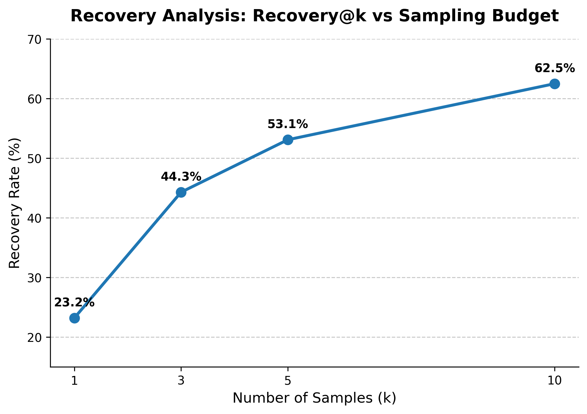

# LLM Code Generation Evaluation on MBPP

A reproducible evaluation of a small open-weight code model on the MBPP benchmark.
It goes beyond a single pass rate to ask a sharper question: **when greedy decoding
fails, where does the failure come from, and can stochastic sampling recover it?**

- **Model:** `Qwen/Qwen2.5-Coder-1.5B-Instruct`
- **Dataset:** MBPP (`full` config), first 100 problems
- **Hardware:** Google Colab, T4 GPU
- **Notebook:** `LLM_Code_Generation_Evaluation_on_MBPP.ipynb`

## Headline

| Metric | Result |
|---|---|
| Pass@1 (greedy baseline) | 60 / 100 |
| Compilation Rate | 100 / 100 |
| Improved Prompt | 61 / 100 (+1) |
| Recovery@10 on failed tasks | 25 / 40 (62.5%) |
| Greedy Passes + Recovered Failures | ~85 / 100* |

*Not equivalent to Pass@10 on the full benchmark.

**Key finding.** Engineering the prompt moved Pass@1 by a single problem (60 → 61).
Re-decoding the *same* baseline prompt stochastically (T = 0.8, 10 samples) recovered
**25 of the 40** greedy failures. On this evaluation slice, decoding strategy produced
substantially larger gains than prompt engineering.

## Setup

Each MBPP problem ships with a `text` prompt and a `test_list` of assertions.
`split_tests` uses the first two assertions as few-shot context in the prompt and holds
out the third as a single hidden evaluation test. A problem counts as a pass only if the
generated function executes and satisfies that held-out assertion. Throughout, "passing"
and "recovered" are **measured relative to the MBPP reference implementation**, which is
a practical oracle rather than a perfect one.

## How to Run

```bash
git clone https://github.com/<your-username>/LLM_Code_Generation_Evaluation_on_MBPP.git
cd LLM_Code_Generation_Evaluation_on_MBPP
pip install -r requirements.txt
```

`requirements.txt`:

```
transformers
datasets
torch
accelerate
```

Then open `LLM_Code_Generation_Evaluation_on_MBPP.ipynb` in **Google Colab** with a
**T4 GPU** runtime (`Runtime → Change runtime type → T4 GPU`) and run the cells top to
bottom. The Recovery Analysis writes its artifacts to Google Drive, so the persistence
setup cell mounts Drive once at the start of the session.

Approximate runtimes:

| Stage | Time |
|---|---|
| Baseline + Improved Prompt (Sections 1–2) | ~16 min |
| Recovery Analysis, 400 generations (Section 3) | ~30–40 min |

The Recovery run is checkpointed to Google Drive and fully resumable: re-running the generation cell skips any
problem that already has 10 samples, so a disconnect costs at most 10 generations.

---

## 1. Baseline Evaluation

The zero-shot baseline achieves a **Pass@1 of 60/100 (60%)** with a **Compilation Rate of
100/100**. The model reliably produces syntactically valid Python; the gap is entirely in
*logic*, not syntax.

An **Improved Prompt** that explicitly requests imports, edge-case handling, and a strict
return format raised this to **61/100 (+1)**. The marginal gain motivated the rest of the
analysis: if better instructions barely help, the failures are not about instruction
adherence.

## 2. Failure Analysis

Each of the 40 greedy failures was re-run with a lightweight in-process `try/except` to
record *how* it fails. (These snippets already ran safely during the baseline, so the
process-isolated harness in Section 4 is unnecessary here.)

| Failure Type | Count |
|---|---|
| AssertionError | 35 |
| TypeError | 2 |
| IndexError | 1 |
| NameError | 1 |
| KeyError | 1 |

Two observations:

**Two observations:**
* **Zero SyntaxErrors**, consistent with the 100% compilation rate — the code always runs; it just computes the wrong answer.
* **Failures are overwhelmingly AssertionError (35/40):** the function returns a value, but the wrong one. The model almost never produces invalid Python. Its failures are overwhelmingly **semantic rather than syntactic**.

Because a bare `assert a == b` raises an empty message, the AssertionError cases were
enriched with the actual vs. expected values (recomputed from the test via AST parsing).
The mismatches are concrete logic/spec gaps — for example returning a `list` where a
`tuple` is expected, inverted booleans, correct elements in the wrong order, or `None`
where a populated structure is required.

## 3. Recovery Analysis

**Question: can stochastic decoding recover greedy failures?** On the 40 failed problems,
the prompt is held **identical to the baseline** and only the decoding changes:
`do_sample=True`, T = 0.8, top_p = 0.95, 10 samples per problem (400 generations total).
Each sample is scored against its held-out test.

**Recovery@10 on failed tasks = 25/40 (62.5%)** — nearly two-thirds of the greedy
failures have at least one passing program within 10 samples.

| Failure Type | Recovered | Rate | Note |
|---|---|---|---|
| AssertionError | 22/35 | 63% | |
| TypeError | 2/2 | 100% | indicative only (small n) |
| IndexError | 1/1 | 100% | indicative only (small n) |
| NameError | 0/1 | 0% | indicative only (small n) |
| KeyError | 0/1 | 0% | indicative only (small n) |
| *(non-Assertion, pooled)* | 3/5 | 60% | all small-n |

Only AssertionError has a usable sample size. The four tail categories (n ≤ 2) are
reported as raw counts and are **indicative only** — a single different outcome swings the
percentage, so no per-type conclusion is drawn from them.

From the same 400 generations, the unbiased estimator
`Recovery@k = 1 − C(n−c, k) / C(n, k)` (averaged over the 40 tasks) traces recovery
against sampling budget:

Recovery@10 is measured directly; Recovery@1, 3, and 5 are estimated from the same 10 samples using the unbiased pass@k estimator.

| k | Recovery@k |
|---|---|
| 1 | 23.2% |
| 3 | 44.3% |
| 5 | 53.1% |
| 10 | 62.5% |



A single stochastic sample — the same compute cost as greedy — already recovers ~23%,
with clear diminishing returns past k = 5.

**Composite.** Combining both phases, **~85/100 problems are solvable under a
greedy-then-10-sample budget** (60 greedy passes + 25 recovered). This is explicitly
**not** "Pass@10 on MBPP": the 60 greedy passes were not re-sampled and the budget is
asymmetric. "Recovered" also means passing the single held-out test — the same yardstick
as Pass@1, not a stronger correctness claim.

The **15 problems that recovered 0/10** are the genuinely hard residual — real capability
gaps, or the occasional spec-ambiguous reference test — and are the natural target for the
self-correction loop in Future Work.

## 4. Evaluation Infrastructure

The Recovery Analysis runs untested, higher-variance generations, where a single
pathological sample (e.g. an infinite loop) could hang the whole run. To contain that,
generated code is executed with **process-isolated, timeout-protected execution** — a
separate, timeout-bounded subprocess. This is process isolation plus a timeout, **not** a
security sandbox (no containerization).

The candidate code is embedded as a `repr()`'d string inside a fixed, always-valid wrapper
and `exec`'d at runtime inside a `try`, so even a `SyntaxError` is caught like any other
exception with no separate return-code path. Each result is emitted on a sentinel-tagged
line (parsing is therefore immune to stray stdout from the generated code) and normalized
to a uniform `{compiled, passed, error_type, error_message}` schema, including a `Timeout`
type and a `NoOutput` guard for hard crashes.

## 5. Future Work

- **Divergent Crash Rate on edge-case inputs.** Measure the share of cases where the
  generated code crashes on an edge input (empty list/string, zero, negative, large
  numbers) *but the MBPP reference does not crash on the same input*. Using the divergence
  from the reference — rather than a raw crash rate — avoids penalizing the model for
  inputs where both implementations crash (e.g. `average([])`), which reflect spec
  ambiguity rather than a model weakness.
- **Agentic self-correction loop.** Feed the execution traceback of a failed test back to
  the model and let it iteratively debug its own code. The 15 problems that recovered 0/10
  under plain sampling are the right target: stochastic decoding alone cannot reach them,
  so they likely need explicit error feedback rather than more samples.
